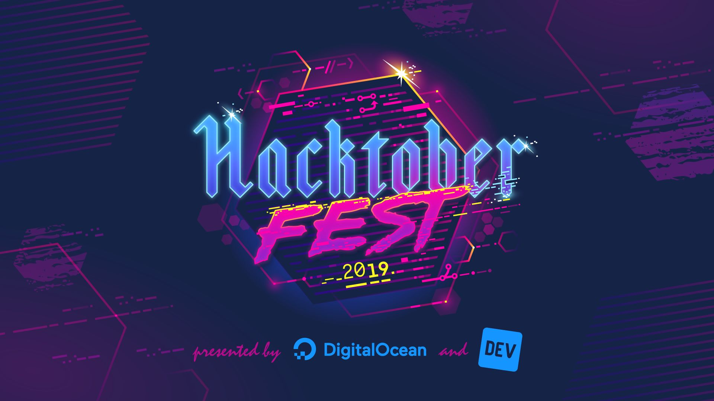

# Welcome to Hacktoberfest 2019  



# What is Hacktoberfest?  
Hacktoberfest is a month-long celebration of open source software run by DigitalOcean and DEV. 
It is open to everyone in their global community! 
You can easily earn a limited edition T-shirt by submitting 4 pull requests to public GitHub repositories between October 1 and October 31 
after signing up on the [Hacktoberfest website](https://hacktoberfest.digitalocean.com/).   

Read my Hacktoberfest 2018 experience here: _[Hacktoberfest 2018 — My foray into the World of Open Source](https://medium.com/@agarwalrounak/hacktoberfest-2018-my-foray-into-the-world-of-open-source-a8bac8651ade)_.
 
# Getting Started
* Register for Hacktoberfest [here](https://hacktoberfest.digitalocean.com/). 

* Fork this repository on GitHub by clicking the <kbd><b>Fork</b></kbd> 
button in the top right of this page. 

* Clone your forked repo to your local machine.  
`git clone https://github.com/YOUR-USERNAME/Hello-World.git`  
Replace `YOUR-USERNAME` above with your GitHub username. 

* Create a new branch.  
`git checkout -b new-branch`

* Add your contributions.  
Have a look at [CONTRIBUTING.md](CONTRIBUTING.md). There are 3 easy ways to contribute to this project: 
  * Add a "Hello, World!" program in any language you like. 
  * Add your name to the CONTRIBUTORS.md file. 
  * Add your profile page to the profiles directory.  
   
* Commit and push your changes.
```
git add -A 
git commit -m "Your commit message"
git push --set-upstream origin new-branch
```

* Create a Pull Request by navigating to your forked repository and 
clicking the <kbd><b>New pull request</b></kbd> button on your left-hand side of the page.

* Add in a title, edit the PR template, and then press the <kbd><b>Create pull request</b></kbd> button.

* Wait for your Pull Request to be reviewed and merged. 

* Congratulations! You just opened a Pull Request. 

# How to Contribute
### 1. Add a "Hello, World!" program
Add your `Hello World` program to the [code](code) directory in any language of your choice. 
Remember to add your program in the particular language folder. 
The file name should not match with an already present file. 
If there is no language folder, make one, then add into it. 

### 2. Add your name 
Add your name to the [CONTRIBUTORS.md](CONTRIBUTORS.md) file using the below example:  
`- [Name](Link to GitHub profile)`  
Please follow alphabetical order.

### 3. Add your profile page
Add your profile page named `Your_Name.md` to the [profiles](profiles) directory. Here is an example to get you started:  
```
## Your Name

### Bio
A short line about you. 

### Location
Home Sweet Home.

### Projects
The super cool projects that you have built. 

### Hobbies & Interests
The super awesome things that intrigue you and bring you joy.

### Profiles
[![GitHub][github-img]](Link to GitHub profile) 
[![Twitter][twitter-img]](Link to Twitter profile)
  
<!-- Don't edit the below 2 lines -->
[twitter-img]: https://i.imgur.com/wWzX9uB.png
[github-img]: https://i.imgur.com/9I6NRUm.png
```

Choose one of above or all 3, make a pull request for your contributions and wait for it to be merged!

# What next? 
- :star: Go ahead and star this repository if you had fun! :star:   
- If you liked contributing to this project, please share and star this project to help as many people as possible to get started in Open Source.
- Browse more such issues to contribute to on [GitHub](https://github.com/search?q=label%3Ahacktoberfest+state%3Aopen&type=Issues).

<p align="center">:confetti_ball: :tada: <strong>Happy Hacktoberfest and Happy Contributing</strong> :tada: :confetti_ball:</p>

[twitter-img]: https://i.imgur.com/wWzX9uB.png
[github-img]: https://i.imgur.com/9I6NRUm.png